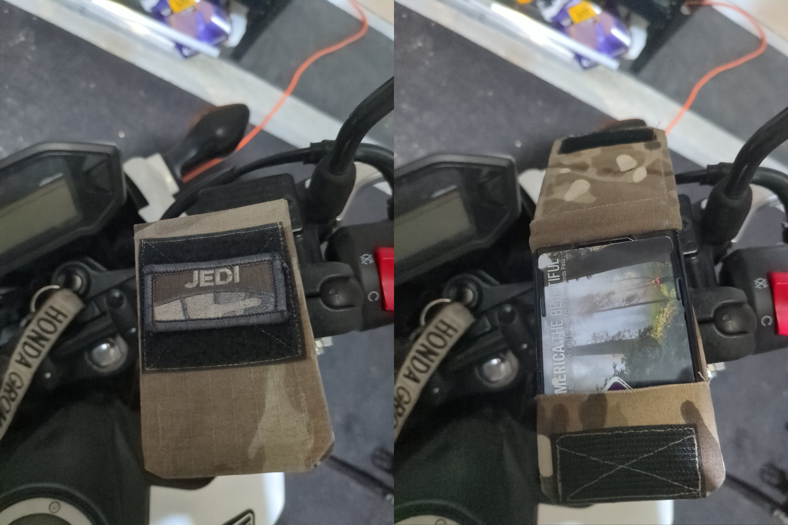

# RAM® Mount Badge Holder
Below are instructions for creating a badge holder to RAM® mount adapter for use on motorcycles or other applications where you want to have a standard ID-1/CR80 card mounted via a RAM® mount.  This could be used with a Military Common Access Card (CAC), Credit Card, Employee Badge or other card in any situation you need fast access to the card (such as going through a gated, or access controlled area in a vehicle).  Feel free to modify, redistribute, or sell these instructions as you see fit as these instructions are released under a Creative Commons Zero (CC0) license.  Do note that RAM®, Identity Stronghold®, CORDURA®, 3M™ and RockyWoods® were not worked or consulted with for the creation of this adapter and retain all of their copyrights and trademarks.



## Bill of Materials

Below is the Bill of Materials for building this adapter.  Do note this does not include the other side of the B-Size RAM® mount to affix this adapter.

1. Identity Stronghold® Secure Badge Holder DuoLite™ Vertical 2 Card Holder (IDSH2004-001B)
   - https://www.idstronghold.com/collections/badgeholders/products/secure-badge-holder-duolite-portrait
2. RAM® Diamond Ball Base (RAM-B-238U)
   - https://www.rammount.com/part/RAM-B-238U
3. 367mm x 80mm CORDURA® Nylon Fabric
   - https://www.rockywoods.com/FABRICS/CORDURA/CORDURA-Nylon-Fabrics
4. Medium Duty Thread
   - https://www.rockywoods.com/THREAD/Medium-Duty-Thread
5. 87mm x 2" Sew-On Tape Fastener Loop
   - https://www.rockywoods.com/2-Mil-Spec-Tape-Fastener-Loop
6. 27mm x 2" Sew-On Tape Fastener Hook
   - https://www.rockywoods.com/2-Mil-Spec-Tape-Fastener-Hook
7. 3M™ Scotch-Weld™ Epoxy Adhesive DP125
   - https://www.3m.com/3M/en_US/company-us/all-3m-products/~/3M-Scotch-Weld-Epoxy-Adhesive-DP125/?N=5002385+3293242443&preselect=3293786499&rt=rud

## Tools

Below are the tools that are required and or suggested for completing this project.

1. Sewing Machine (w/1" Button Hole function)
2. Small Snips or Scissors
3. Small Clamps
4. Writing Implement
5. Tape Measurer
6. Expoy Dispenser
7. Seam Ripper (because mistakes happen)

## Instructions

1. From the CORDURA® Nylon Fabric cut three strips in the following sizes:
  - 80mm x 112mm
  - 80mm x 45mm
  - 80mm x 210mm
  
```
┏━━━━━━┓ ┏━━━━━━┓
┃┏━━━━┓┃ ┃┏━━━━┓┃
┃┃    ┃┃ ┃┃    ┃┃
┃┃    ┃┃ ┃┃    ┃┃
┃┗━━━━┛┃ ┃┃    ┃┃
┗━━━━━━┛ ┃┃    ┃┃
         ┃┃    ┃┃
┏━━━━━━┓ ┃┃    ┃┃
┃┏━━━━┓┃ ┃┃    ┃┃
┃┗━━━━┛┃ ┃┗━━━━┛┃
┗━━━━━━┛ ┗━━━━━━┛
```

> ℹ️ **Note:** These pieces are wider than the badge holder by ~1cm on each side to give room for sewing

2. From the Sew-On Tape Fastener Hook and Loop cut three strips of the following sizes:
  - 27mm - Hook
  - 27mm - Loop
  - 60mm - Loop
```
┏━━━━┓ ┏━━━━┓ ┏━━━━┓
┃░░░░┃ ┃▓▓▓▓┃ ┃▓▓▓▓┃
┗━━━━┛ ┗━━━━┛ ┃▓▓▓▓┃
              ┗━━━━┛
```

3. Sew the 27mm Hook (NOT loop) piece to the outside of the 45mm cordura piece 14mm from the bottom.

> ℹ️ **Note:** Be sure to secure the velcro with ~3 backstiches to prevent unravelling - a linear stich around 0.5cm in length will work, though feel free to experiment with whatever stich style you want.

4. Sew the fabric strips together with their outsides facing each other (so that they are inside out) with the 45mm piece aligned to the bottom of the 210mm piece and the 112mm piece aligned with the top of the 210mm piece.

5. Turn the now sewn together pieces right side out to form two pockets, one 45mm tall, and the other 112mm tall

> ℹ️ **Note:** You will notice that the extra 1 cm gap is wanting to fold inward on the space we left behind, and that we will only need the 45mm pocket to be open; this will be addressed in the next step

6. Flatten out the edges that have curled in between the two pockets and sew a sharp U along those edges and around the open-end of the 112mm pocket, sewing it closed.

> ⚠️ **Warning:** Only sew the 112mm pocket closed, we will need the 45mm pocket open to fit the ID card holder!

7. Sew the Loop pieces to the (now closed) 112mm flap
  - 27mm - Loop: 6mm from the bottom of the inside of the 112mm fabric flap (such that it aligns with the 27mm Hook piece)
  - 60mm - Loop: 45mm from the bottom of the outside of the 112mm fabric flap (such that it fully clears the underside of the stiching for the 27mm Loop)

8. Snip off the lanyard hanger at the top of the ID card holder such that the edge is flush.

9. Using the Scotch-Weld™ DP125 Epoxy, glue the RAM® Ball Base such that the diamond is vertical, centered and touching the top of the back of the ID card holder.

10. Use the button hole function of your sewing machine, sew a 1-inch button hole 45mm from the bottom of the fabric you have assembled, just above the 45mm pocket.

11. After letting the glue dry, insert the ID card holder into the 45mm flap and ball-side into the button hole and check the fitment, adjusting things as needed.

12. Once you are happy with it, add epoxy into the pocket, and the back of the ID card holder/button hole to secure the two permanently together.

> ℹ️ **Note:** Make sure that the glue is uniformly distributed and reaches from the bottom to the top of the ID card holder for a clean finish.
